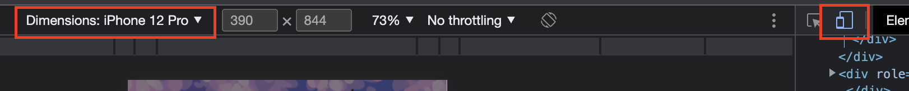

# Fitness Floofs

_Duration: 1 week to scope & 2 weeks to code_

## Description
A gamified steptracker that incentives the user to walk 10,000 steps a day, this makes their daily egg hatch, and the user gets a new cartoon floof. There are 11 different floofs types with varying rarities. Depending on how rare the floof is, it will generate a different amount of money each day. As you collect money from your floofs daily, you can save up to buy backgrounds for your flock page.

## Presentation
The demo starts at the 1 minute mark and is 3 minutes long.

## Usage
    - You can access my project using the Heroku app link here: https://thawing-oasis-04805.herokuapp.com/#/login
        - Using google chrome, right click the screen and select 'inspect'. Adjust the screen size by selecting the phone icon in the top left of the console that just appeared. Adjust the screen resolution to 'iPhone 12 Pro' (SCREENSHOT BELOW).
        - Login to an existing account using the username: 'user' and password: '1234'.
        - The Heroku app does not have access to the Google API client secret, so you'll see an error message from google after logging in. It won't be able to connect to the API.

    - Or you can run it on your own computer:
        - Clone files from github
        - Create a database using the code on database.sql, port: 5432
        - Within the terminal, run: 
            -'npm install' 
            -'npm run server'
            -'npm run client'
        - Using google chrome, right click the screen and select 'inspect'. Adjust the screen size by selecting the phone icon in the top left of the console that just appeared. Adjust the screen resolution to 'iPhone 12 Pro' (SCREENSHOT BELOW).
        - Login to an existing account using the username: 'user' and password: '1234'.
        - Github does not have access to my Google API client secret, so you'll see an error message from Google after logging in. It won't be able to connect to the API.
        - When finished interacting with the project, shut down the server and client with ctrl + c

## Built With
Javascript, React, Redux, Google REST Fit API, Express.js, PostgreSQL, Sagas, Node.js, Material UI, CSS, HTML, Figma, GIMP, Prezi

## Support
If you have suggestions or issues, please email me at [kelsey.peterson14@gmail.com] or reach out on my Linkedin [linkedin.com/in/kelsey-peterson820682173].

## Thanks!
